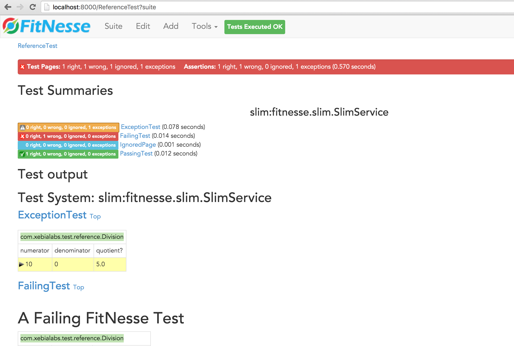

# Fitnesse test results

## Generate test results:

Execute `gradlew testReference` to generate test results for the fitnesse TestReference suite. 

This will produce test-results in `FitnesseRoot/files`.

Running Fitnesse multiple times will add test-results to the existing `files` dir, ie it does not clean first.

The output will be that the gradle tasks fails, because it has failing tests:
Example output:
```
:compileJava UP-TO-DATE
:processResources UP-TO-DATE
:classes UP-TO-DATE
:compileTestJava UP-TO-DATE
:processTestResources UP-TO-DATE
:testClasses UP-TO-DATE
:test UP-TO-DATE
:writeFitNesseClasspath UP-TO-DATE
:testReference
Nov 24, 2015 3:14:42 PM fitnesse.ConfigurationParameter loadProperties
Bootstrapping FitNesse, the fully integrated standalone wiki and acceptance testing framework.
root page: fitnesse.wiki.fs.FileSystemPage at ./FitNesseRoot#latest
logger: none
authenticator: fitnesse.authentication.PromiscuousAuthenticator
page factory: fitnesse.html.template.PageFactory
page theme: bootstrap
Starting FitNesse on port: 8000
Executing command: ReferenceTest?suite&format=text
-----Command Output-----

Starting Test System: slim:fitnesse.slim.SlimService.
X 15:14:42 R:0    W:0    I:0    E:1    ExceptionTest	(ReferenceTest.ExceptionTest)	0.083 seconds
F 15:14:42 R:0    W:1    I:0    E:0    FailingTest	(ReferenceTest.FailingTest)	0.010 seconds
. 15:14:42 R:0    W:0    I:0    E:0    IgnoredPage	(ReferenceTest.IgnoredPage)	0.001 seconds
. 15:14:42 R:1    W:0    I:0    E:0    PassingTest	(ReferenceTest.PassingTest)	0.012 seconds
--------
4 Tests,	2 Failures	0.476 seconds.
-----Command Complete-----
:testReference FAILED

FAILURE: Build failed with an exception.
```

## Running Fitnesse and execute from there

Execute `gradlew run`. Then go to [http://localhost:8000/ReferenceTest](http://localhost:8000/ReferenceTest).

You can click 'suite' at the top, which will Execute the suite and give you something like this:



